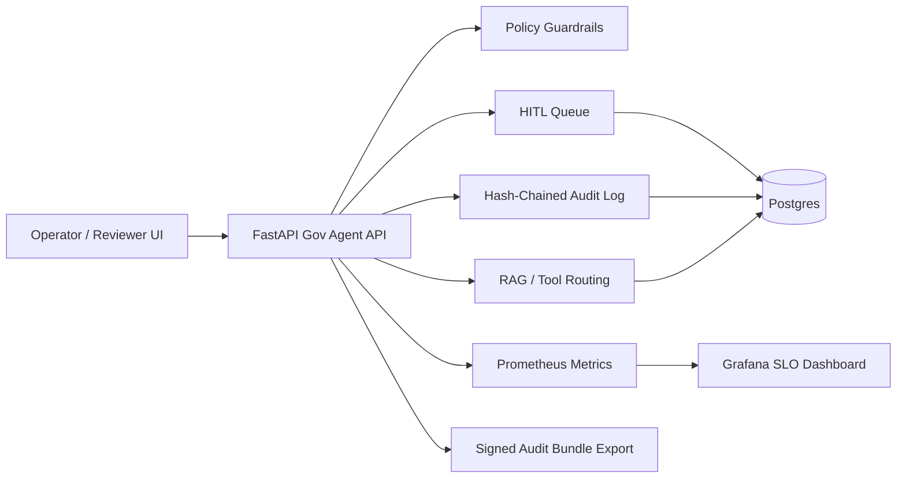

# Gov-Agent-in-a-Box

**Gov-Agent-in-a-Box** is a local, CPU-friendly reference app that demonstrates how a public-sector team could design, operate, inspect, and govern AI agents in a high-compliance environment.

The project is intentionally built with **synthetic data only** and can run locally in Docker. It is designed to show the product and technical building blocks behind government-grade AI agent workflows: policy guardrails, human-in-the-loop review, auditability, data-residency controls, observability, rollback, and evidence artifacts.

> **Demo only. Do not use with real PII/PHI. This is not a production or FedRAMP-authorized system.**

---

## Why this project exists

Government AI deployments need more than a chatbot demo. They need a way to prove that agentic workflows can be useful while still supporting:

- privacy and redaction controls,
- human review and escalation,
- region/data-residency constraints,
- audit logs that can be exported and verified,
- operational SLOs and error-budget monitoring,
- safe rollback when a guardrail over-fires.

This repo packages those ideas into a runnable reference app.

---

## Core capabilities

| Capability | What is implemented |
|---|---|
| Agent orchestration | Local task submission flow with RAG-style document lookup and tool/model routing placeholder. |
| Policy-as-code guardrails | PII detection/redaction, SSN block, allow/deny behavior, region gating, quota rejection hooks. |
| Human-in-the-loop review | HITL queue with approve, deny, escalate, assign, comment, reviewer nudges, and streak tracking. |
| Inspection console | Original vs. redacted view, policy reasons, redaction tokens, and reviewer decision context. |
| Rollback | 60-second rollback flow for over-redaction, with audit logging. |
| Immutable audit | Hash-chained audit log, audit verification, signed audit export, and signature verification. |
| Data residency | Separate logical regions such as `us_east` and `eu_central`. |
| Observability | Prometheus metrics and Grafana SLO dashboard for p95 latency, RPS, burn rate, error rate, cache hit-rate, quota rejects, and HITL queue size. |
| Synthetic data | Seed prompts, policy tests, fake agency documents, and optional synthetic case generation. |
| Evidence pack | One-pager, decision memos, red-team notes, CUPED note, and limits/next-steps. |

---

## Screenshots and demo assets

Add the following files under `assets/` before publishing:

```text
assets/
  ui-submit.png
  hitl-dashboard.png
  rollback.gif
  grafana-slo.png
  audit-export-verify.png
```

### Risky prompt → redaction → HITL enqueue


### HITL review console


### 60-second rollback flow


### SLO and operations dashboard


### Signed audit export and signature verification


---

## Architecture



### Runtime services

| Service | Default URL |
|---|---|
| Web UI | `http://localhost:5173` or `http://localhost:5174` |
| API health | `http://localhost:8000/health` |
| API metrics | `http://localhost:8000/metrics` |
| Prometheus | `http://localhost:9090` |
| Grafana | `http://localhost:3000` |

---

## Quickstart: Windows PowerShell

From the repo root:

```powershell
cd C:\path\to\gov-agent-in-a-box
```

Start the backend stack:

```powershell
docker compose up -d --build
```

Check the API:

```powershell
curl.exe http://localhost:8000/health
```

Start the web UI in a second PowerShell terminal:

```powershell
cd app\web
npm install
npm run dev -- --port 5173
```

Open:

```text
http://localhost:5173
```

If port `5173` is busy, Vite may use `5174`.

---

## Quickstart: macOS/Linux/Git Bash

```bash
docker compose up -d --build
curl -s http://localhost:8000/health

cd app/web
npm install
npm run dev -- --port 5173
```

---

## Smoke test: create a redacted task

### PowerShell

```powershell
$body = @{
  prompt = "My email is a.user@example.com. Please help."
  region = "us_east"
  top_k  = 3
} | ConvertTo-Json

Invoke-RestMethod `
  -Method Post `
  -Uri "http://localhost:8000/v1/tasks" `
  -ContentType "application/json" `
  -Body $body
```

Expected behavior:

- `status: ok`
- `pre_action: allow_with_redaction`
- `redacted_prompt` contains `[[TOKEN:...]]`
- a `hitl_id` is created
- the item appears in the HITL queue

---

## Demo flow

A strong 3-minute walkthrough is:

1. **Submit risky prompt**  
   Use an email-containing prompt and show policy redaction.

2. **Inspect HITL item**  
   Open the review panel and show original vs. redacted text, policy reasons, and redaction tokens.

3. **Rollback within 60 seconds**  
   Click `Rollback (60s)` and show the redacted text being reversed or the rollback success message.

4. **Approve / deny / escalate**  
   Demonstrate reviewer decision workflow with a comment.

5. **Audit export and verification**  
   Show audit chain verification and signed audit bundle verification.

6. **Grafana SLO dashboard**  
   Show p95 latency, RPS, success rate, burn rate, cache hit-rate, error rate, quota rejects, and HITL queue size.

---

## Rollback demo command

Create a fresh rollback-eligible item. Use the UI immediately after this because rollback is time-bound.

```powershell
$stamp = Get-Date -Format "HH:mm:ss"

$body = @{
  prompt = "Demo rollback item $stamp. My email is demo.user@example.com. Please help me with my appeal."
  region = "us_east"
  top_k  = 3
} | ConvertTo-Json

Invoke-RestMethod `
  -Method Post `
  -Uri "http://localhost:8000/v1/tasks" `
  -ContentType "application/json" `
  -Body $body
```

Then open the latest HITL item and click:

```text
Rollback (60s)
```

---

## Audit export and signature verification

Create an audit event:

```powershell
$body = @{
  prompt = "My email is a.user@example.com. Please help."
  region = "us_east"
  top_k  = 3
} | ConvertTo-Json

Invoke-RestMethod `
  -Method Post `
  -Uri "http://localhost:8000/v1/tasks" `
  -ContentType "application/json" `
  -Body $body
```

Verify the database audit chain:

```powershell
Invoke-RestMethod `
  -Method Get `
  -Uri "http://localhost:8000/audit/verify" | ConvertTo-Json -Depth 10
```

Export a signed audit bundle:

```powershell
$export = Invoke-RestMethod `
  -Method Post `
  -Uri "http://localhost:8000/audit/export"

$export | ConvertTo-Json -Depth 10
```

Verify the exported bundle signature:

```powershell
Invoke-RestMethod `
  -Method Get `
  -Uri "http://localhost:8000/audit/verify-export" | ConvertTo-Json -Depth 10
```

Expected success fields:

```json
{
  "ok": true,
  "sig_checked": true,
  "sig_ok": true,
  "root_hash": "..."
}
```

---

## Grafana SLO dashboard

Open Grafana:

```text
http://localhost:3000
```

Default local credentials, if unchanged:

```text
admin / admin
```

The dashboard should show:

- p95 latency
- p95 latency over time
- steady RPS
- success rate
- short and long burn rate
- API error rate by reason
- cache hit-rate
- quota rejects by principal
- HITL queue size by region

To generate traffic for cache hit-rate and RPS:

```powershell
for ($i=0; $i -lt 30; $i++) {
  $body = @{
    prompt = "Repeat me: a.user@example.com"
    region = "us_east"
    top_k  = 3
  } | ConvertTo-Json

  Invoke-RestMethod `
    -Method Post `
    -Uri "http://localhost:8000/v1/tasks" `
    -ContentType "application/json" `
    -Body $body | Out-Null
}
```

Useful PromQL snippets:

```promql
rate(cache_hits_total[5m])
rate(cache_misses_total[5m])
```

Cache hit-rate panel:

```promql
100 * sum(rate(cache_hits_total[5m]))
  / (sum(rate(cache_hits_total[5m])) + sum(rate(cache_misses_total[5m])))
```

---

## Synthetic data

This repo is intended to ship with synthetic data only.

Suggested structure:

```text
sample-data/
  README.md
  policy/
    policy-tests.jsonl
    synth-prompts.jsonl
  docs/
    us/
    eu/
  seeds/
```

Generate larger synthetic prompt sets:

```powershell
python scripts/gen_synth.py prompts --n 5000 --regions us_east --regions eu_central --seed 123 --out sample-data/policy/synth-prompts.jsonl
```

Seed tasks through the API:

```powershell
python scripts/seed_tasks.py sample-data/policy/synth-prompts.jsonl
```

All generated emails should use `example.com`; SSNs should use clearly non-assignable demo patterns such as `000-12-3456`.

---

## Evidence pack

Suggested docs:

```text
docs/
  one-pager.docx
  01-flags-vs-forks.md
  02-why-cuped.docx
  03-why-dual-control.docx
  red-team-report.md
  limits-and-next-steps.md
```

Decision memo themes:

- **Feature flags over forks** to keep one deployable artifact and reduce audit/config drift.
- **CUPED** to improve experiment sensitivity under low-traffic public-sector pilots.
- **Dual control** for sensitive actions such as unredaction, break-glass, and quota expansion.

---

## Project structure

```text
app/
  api/
    main.py
    requirements.txt
  db/
    00-init.sql
    patches/
  web/
    src/
    tests/
assets/
  ui-submit.png
  hitl-dashboard.png
  rollback.gif
  grafana-slo.png
  audit-export-verify.png
docs/
sample-data/
scripts/
docker-compose.yml
prometheus.yml
README.md
LICENSE
```

---

## Testing

Install Playwright in the web app:

```powershell
cd app\web
npm install
npm i -D @playwright/test @types/node typescript
npx playwright install
```

Run E2E tests:

```powershell
npm run test:e2e
```

If the UI is on port `5174`:

```powershell
$env:UI_BASE="http://localhost:5174"
$env:API_BASE="http://localhost:8000"
npm run test:e2e
```

---

## Troubleshooting

### `docker` is not recognized

Install and start Docker Desktop, then reopen PowerShell:

```powershell
winget install -e --id Docker.DockerDesktop
docker --version
docker compose version
```

### UI starts on port 5174

This is normal if 5173 is busy. Open:

```text
http://localhost:5174
```

### Rollback button is disabled

Rollback is intentionally time-limited. Create a fresh redacted task and click the newest HITL item within 60 seconds.

### Audit chain invalid

For demo data only, clear old synthetic rows and recreate fresh audit events:

```powershell
docker exec -i gov_db psql -U govagent -d govagent -c "TRUNCATE TABLE public.hitl_action, public.hitl_item, public.audit_log RESTART IDENTITY CASCADE;"
```

### PowerShell hides the server error body

Use:

```powershell
try {
  Invoke-RestMethod -Method Post -Uri "http://localhost:8000/audit/export" | ConvertTo-Json -Depth 10
} catch {
  $_.ErrorDetails.Message
}
```

---

## Limitations and next steps

This is a reference build, not a production control plane.

Known limitations:

- Authentication/RBAC is demo-grade and should be replaced with OIDC/SSO and scoped tokens.
- Guardrails are pattern/rule based and should be expanded for domain-specific identifiers and multilingual data.
- Differential privacy and CUPED flows are illustrative.
- Cost and quality panels use local estimates rather than production billing integrations.
- Data-residency controls are simulated locally rather than enforced by cloud enclave/KMS policy.

Real-world validations to run with an agency:

1. Records-retention drill.
2. FOIA export dry run.
3. Enclave no-egress verification.
4. Break-glass tabletop exercise.
5. Policy tuning review with agency counsel/security.

---

## License

This project is intended to be released under the license included in `LICENSE`.

---

## Recruiter / portfolio summary

Built a local, air-gapped-friendly public-sector AI agent governance reference app showing policy-as-code guardrails, HITL review, redaction inspection, rollback, region routing, signed audit export, Prometheus/Grafana SLOs, synthetic data generation, and evidence-pack documentation.
